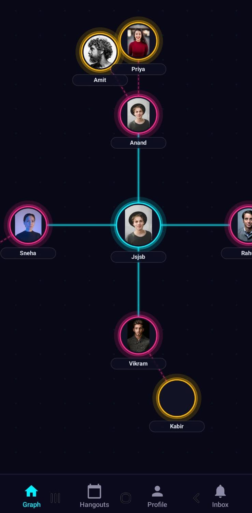

# VibeWire - 1st & 2nd-Degree Hangout Planning App

### GDSC Open Project 2025 : 7th June - 7th Jul
*Authors:* Anand Bansal, Aayush Bhoj

---

## About

VibeWire is a modern social networking and hangout coordination application designed for college students, professionals, and close-knit groups. It leverages hybrid databases (relational + graph) to map and visualize your social circle up to 2 degrees of connection.

Discover friends-of-friends (2nd-degree connections), see your shared paths, explore mutual connections through an interactive 2D social graph, and organize hangouts with real-time invite tracking.

---

## Visual Social Graph

The core experience of VibeWire centers around a glowing, interactive neon social graph. It is fully scrollable, center-aligned on the user node, and visually displays connection paths dynamically:



*Key Highlights:*
- **User Node (Center):** Glowing cyan backdrop showing your own profile.
- **1st-Degree Friends (Inner Ring):** Connected by solid teal lines with a hot pink border indicating close connections.
- **2nd-Degree Friends (Outer Fan-Out):** Grouped around their connecting mutual friend, linked by dashed lines with gold borders.

---

## Features

### 🔐 Secure Authentication & Onboarding
- Phone number verification with OTP (supports development mock verification).
- High-fidelity dark mode forms for sign-up and login.
- Smart connection selection on first login (selects initial seed network of up to 8 connections).

### 🕸️ Interactive Social Graph
- 2D scrolling/panning viewport centered around the active user.
- Interactive connection profile preview modals when clicking nodes.
- Distinct styling differentiating direct (1st-degree) and indirect (2nd-degree) connections.

### 📅 Hangout & Event Planning
- Create new hangouts by choosing details like title, date, time, venue, and participant limit.
- Select from 1st and 2nd-degree connections to add to hangouts.
- Direct invite tracking: connections receive invites in their *Inbox* to accept or decline.

### 👤 Profile Customization
- View stats (e.g., connection counts, bhawan details).
- Edit name, bio, and upload profile pictures.
- Shared auth-context state propagation to ensure the profile tab and graph center update synchronously.

---

## Tech Stack

### Frontend
- **Framework:** React Native with Expo (TypeScript)
- **Routing:** Expo Router
- **Graphics:** React Native SVG (for canvas graph layout rendering)
- **Storage:** React Native AsyncStorage for session persistence

### Backend
- **Framework:** Node.js & Express (RESTful APIs)
- **Relational DBMS:** PostgreSQL / MySQL via Sequelize ORM (handles user credentials, sessions, hangouts, and invite metadata)
- **Graph DBMS:** Neo4j (handles connection paths, high-speed 1st/2nd-degree traversal, and graph-nodes discovery)

---

## Project Structure

```
VibeWire/
├── backend/                    # Node.js + Express backend server
│   ├── database/
│   │   ├── config/             # DB and Neo4j connection configs
│   │   ├── controllers/        # Route controller logic (auth, connections, hangouts, etc.)
│   │   ├── models/             # Sequelize/SQL database models
│   │   └── seed.js             # Database seeding script
│   ├── middleware/             # Route protections & JWT auth
│   └── routes/                 # Express REST endpoint routes
├── frontend/VibeWire/          # React Native + Expo App
│   ├── app/
│   │   ├── (tabs)/             # Main Tab Bar Screens
│   │   │   ├── index.tsx       # 2D Interactive Social Graph
│   │   │   ├── hangouts.tsx    # List and Create Hangouts
│   │   │   ├── invites.tsx     # Hangouts Invites Inbox
│   │   │   └── profile.tsx     # Profile Settings & Connections List
│   │   │   └── _layout.tsx     # Tab configuration & styling
│   │   ├── _layout.tsx         # Root stack layout (Auth Context wrapper)
│   │   ├── welcome.tsx         # Welcome Landing Screen
│   │   ├── login.tsx           # Account Login Screen
│   │   ├── signup.tsx          # Account Sign-Up Screen
│   │   ├── otp-verify.tsx      # Phone OTP Verification Screen
│   │   └── connections-select.tsx # Onboarding Connection Seeding
│   ├── components/             # Reusable UI & IconSymbol components
│   └── src/
│       ├── context/            # AuthContext (state handling)
│       └── services/           # Axios API Client Wrapper
└── assets/                     # Screenshots and graphics
```

---

## Getting Started

### Backend Setup
1. Navigate to the `backend` folder:
   ```bash
   cd backend
   ```
2. Install dependencies:
   ```bash
   npm install
   ```
3. Create a `.env` file based on `.env.example` and fill in your PostgreSQL and Neo4j connection credentials.
4. Run the seed script to populate mock users and friendships:
   ```bash
   npm run seed
   ```
5. Start the backend development server:
   ```bash
   npm run dev
   ```

### Frontend Setup
1. Navigate to the `frontend/VibeWire` directory:
   ```bash
   cd frontend/VibeWire
   ```
2. Install dependencies:
   ```bash
   npm install
   ```
3. Start the Expo CLI development server:
   ```bash
   npx expo start -c
   ```
4. Run the app:
   - Scan the QR code using the **Expo Go** app on iOS or Android.
   - Or press `a` for Android emulator or `i` for iOS simulator.
